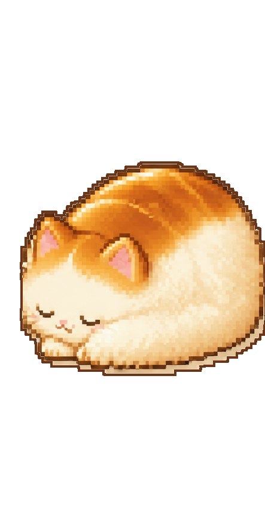

# Mascot direction: Shokupan cat

Status: **Visual direction locked; proportions in refinement**

This document is the durable source of truth for mascot concepts and future
image-generation prompts. The character name is provisional.

## Canonical reference

This crust-cap Shokupan cat is the canonical character direction.

## Locked character identity

- A cream, long-haired cat whose anatomy naturally forms a whole Japanese milk
  bread (`shokupan`) silhouette.
- The cat and bread are one organism. The design must never look like a cat
  head attached to a bread box, a cat wearing bread, or a normal cat painted
  with bread markings.
- A thin honey-gold crust cap flows continuously from the forehead, over the
  ears, and across the rounded back.
- The pale face, chest, and body read as both fluffy cream fur and pillowy milk
  bread crumb.
- Small triangular ears emerge from the crust contour. They are feline ears,
  not leaves or fantasy appendages.
- A thick, cream-tipped tail wraps around the body and helps complete the lower
  loaf silhouette.
- The face is small and gentle, with restrained cocoa-brown features and a
  muted pink nose and inner ears.

## Shape and pose language

- Prefer dynamic three-quarter poses with overlap, foreshortening, and a clear
  front-to-back turn.
- Curled, tucked, rolling, stretching, and peeking poses suit the character.
- The body should feel soft, weighty, and compressible, like a resting cat and
  freshly baked milk bread at the same time.
- Avoid flat, symmetrical, front-facing presentation as the default. It makes
  the face feel too wide and the mascot feel like a two-dimensional badge.
- Bread cues come from the overall pillowy silhouette and continuous crust cap,
  not literal cuts, panels, or accessories.

## Proportions to refine

The selected design is canonical, but its exact ratios are not. For the next
proportion study, use the following as provisional adjustments:

- Make the resting body slightly longer and lower so it reads as a relaxed cat,
  not a near-circle.
- Reduce the face and ears slightly relative to the body.
- Keep the muzzle narrow; do not widen the face into a square or badge.
- Retain the large wrapping tail, but lower its tip so it supports the body arc
  without dominating the silhouette.
- Preserve visible overlap among head, shoulder, haunch, and tail at small size.

Do not treat numerical ratios as locked until a dedicated model sheet is
approved.

## Pixel-art treatment

- Design at approximately `48 x 48` logical pixels per normal pose, then scale
  with nearest-neighbor interpolation.
- Use deliberate pixel clusters and hard edges; no antialiasing.
- Finish the transparent silhouette with a four-source-pixel cocoa-brown
  contour. It stays visually crisp when the source art is fractionally scaled
  down at the smallest supported avatar size, keeping pale fur clean over both
  light and dark desktops.
- Use roughly 12–16 colors with simple two-step shading.
- Keep idle animation sparse and low-arousal. Favor held poses with occasional
  small changes over constant movement.
- Preserve readability at desktop-pet scale before adding texture or detail.
- Reduced-motion mode should use a still pose or minimal state transition.

## Expression language

- **Focused:** closed eyes, relaxed face, slow breathing or a subtle dough-rise
  motion.
- **Grace:** one eye opens or one ear rotates; curious rather than accusatory.
- **Nudge:** an abrupt extreme `0.5x`-lens side-profile stare. The near eye is a
  large, mostly dark oval with a narrow pale rim and restrained catchlight. The
  forehead and cheek fill the foreground; the muzzle and tiny pink nose project
  delicately; the loaf body recedes sharply. It should feel blank, innocent,
  watchful, and funny—not alarmed or anime-styled.
- **Intervention:** not yet visually locked. Keep it reversible and cute rather
  than angry or threatening.
- **Returned/completed:** not yet visually locked.

The nudge can snap into its stare pose with little or no in-between animation;
the abrupt camera-language change is the joke.

## Palette anchor

- Milk crumb/fur: warm cream and ivory
- Crust cap: honey gold through light toast brown
- Deep accents: cocoa brown, not pure black except where the stare needs depth
- Nose and inner ears: muted warm pink
- Background in concept sheets: warm off-white

Exact color values remain open until production sprite work.

## Hard exclusions

- Green accents, leaves, plant ears, or antennae
- Sourdough boules, diagonal scoring cuts, flour crosshatching, sliced bread,
  toast slices, or a bread costume
- Hard vertical bread-box panels or a visible seam between head and body
- Smooth vector-like rendering, painterly fur, excessive gradients, or
  high-frequency texture
- Oversized glossy anime eyes in normal poses
- Constant attention-seeking animation
- Flat default poses with a wide symmetrical face

## Reusable generation anchor

Use this paragraph verbatim as the starting point for future mascot image
generation, then append the requested pose or state:

> The same canonical Shokupan cat: a cream long-haired cat whose continuous
> anatomy naturally forms a whole pillowy Japanese milk-bread silhouette; a
> thin honey-gold crust cap flows from its forehead across its rounded back;
> small triangular ears emerge from that contour; a narrow gentle cream face,
> tiny cocoa features, muted pink nose, and thick cream-tipped tail complete the
> design. Handcrafted 48x48-scale pixel art, hard nearest-neighbor edges,
> limited warm 12–16 color palette, simple two-step shading. Show a dynamic
> three-quarter pose with clear overlap and depth. Never depict a separate cat
> head attached to bread, a bread costume, a flat front-facing badge, sourdough
> scoring, green plant features, realistic fur, smooth vectors, or anime eyes.

## Asset status

The canonical design and individual action/reaction images are concept art, not
production sprite sheets. Production assets still require a finalized
proportion model, consistent logical dimensions, state-specific frames, and
animation timing.

Behavior research and the first generated action sheets live in
[BEHAVIOR_REFERENCES.md](BEHAVIOR_REFERENCES.md).

Every figure and animation frame is also available as an individual
alpha-channel PNG under
[assets/shokupan-cat/isolated](assets/shokupan-cat/isolated/README.md).
